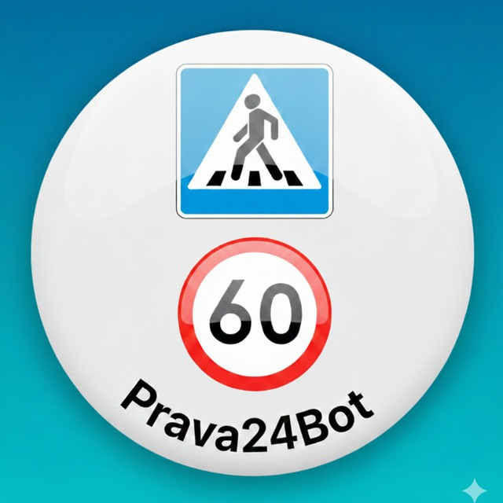

# Prava24 — Haydovchilik Imtihoniga Tayyorgarlik Portali (Google AdSense Ready)



**Prava24.uz** — O'zbekistondagi bo'lajak haydovchilar uchun YHQ (Yo'l harakati qoidalari) va GAI imtihonlariga tayyorlanish bo'yicha to'liq ko'p tilli (O'zbek va Rus tillarida) zamonaviy ta'lim portali.

---

## 🚀 Loyiha Imkoniyatlari va Bo'limlari

- **Онлайн Билеты ПДД / Imtihon Testlari:** Brauzerning o'zida to'g'ridan-to'g'ri ishlovchi 20 talik rasmiy biletlar, taymer, ballar tahlili va xatolarni tushuntirib beruvchi interaktiv simulyator.
- **Yo'l Belgilari Katalogi / Дорожные знаки:** Barcha 6 ta toifadagi rasmiy yo'l belgilari, ularning raqamlari, ma'nolari va qidiruv tizimi.
- **Jarimalar Jadvali 2026 / Штрафы 2026:** MJtK bo'yicha yangilangan BHM jarimalar miqdori va 15 kun ichida 70% chegirma bilan to'lash qoidasi.
- **Qoidalar & Qo'llanmalar / Правила и Советы:** Nazariy va amaliy (avtodrom) imtihonlarni 100% topshirish bo'yicha maqolalar.
- **Yuridik va Ishonch Sahifalari:** Google AdSense talablariga mos Privacy Policy, Terms of Service, About Us, Contact Us hamda Cookie Consent banneri.

---

## 🌐 Ko'p Tilli Tizim (Multilingual)

- **O'zbek tili (`uz`):** `https://prava24.uz/`
- **Rus tili (`ru`):** `https://prava24.uz/ru/` *(AdSense tomonidan rasmiy qo'llab-quvvatlanuvchi asosiy til)*

---

## 📂 Fayl Strukturasi

```text
.
├── index.html                 # Asosiy sahifa (O'zbekcha)
├── tickets.html               # Onlayn Testlar simulyatori
├── road-signs.html            # Yo'l belgilari katalogi
├── fines.html                 # 2026 Jarimalar jadvali
├── rules.html                 # Qoidalar va qo'llanmalar
├── about.html                 # Biz haqimizda
├── contact.html               # Aloqa sahifasi
├── privacy-policy.html        # Maxfiylik siyosati
├── terms.html                 # Foydalanish shartlari
├── ru/                        # To'liq Rus tilidagi portal versiyasi
│   ├── index.html
│   ├── tickets.html
│   ├── road-signs.html
│   ├── fines.html
│   ├── rules.html
│   ├── about.html
│   ├── contact.html
│   ├── privacy-policy.html
│   └── terms.html
├── ads.txt                    # Google AdSense tasdiq kodi
├── robots.txt                 # Qidiruv botlari ko'rsatmalari
├── sitemap.xml                # Barcha tillardagi URL manzillar xaritasi
└── logo.jpg                   # Platforma logotipi
```

---

*© 2026 Prava24.uz — Barcha huquqlar himoyalangan.*
